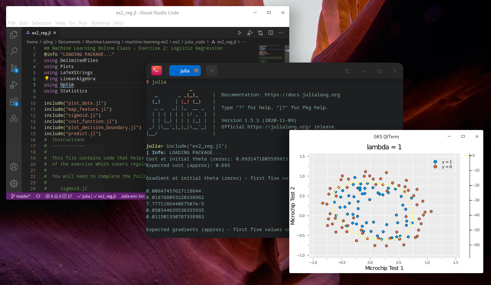

# Coursera Machine Learning Assignments in Julia
[](https://www.linkedin.com/in/soojinro) []() []() []()



## About
This project aims to use Julia programming to complete the course assignments of Machine Learning on Coursera by Prof. Andrew Ng.

## How to start
### Dependencies
This project was coded in Julia 1.5
* DelimitedFiles
* Plots
* LinearAlgebra
* Statistics
* Optim
* LaTeXStrings

### Installation
For example:

```Pkg> add DelimitedFiles```


## Important Note
There are a couple of things to keep in mind before starting.
* In Octave/Matlab, 
    ```matlab
    >> [2 3] * [2; 3]
    >> 13
    ```
    Now, it is
    ```julia
    julia> [2 3] * [2; 3]
    julia> [13]
    ```
    Therefore we recommended using `dot` function
    ```julia
    julia> dot([2 3], [2; 3])
    julia> 13
    ```

## Contents
#### [Exercise 1](https://github.com/rfhklwt/Coursera_ML/tree/master/machine-learning-ex1/ex1/julia_code)
* Linear Regression
* Linear Regression with multiple variables
#### [Exercise 2](https://github.com/rfhklwt/Coursera_ML/tree/master/machine-learning-ex2/ex2/julia_code)
* Logistic Regression
* Logistic Regression with Regularization

## Working...
#### [Exercise 3]()
* Multiclass Classification
* Neural Networks Prediction fuction
#### [Exercise 4]()
* Neural Networks Learning
#### [Exercise 5]()
* Regularized Linear Regression
* Bias vs. Variance
#### [Exercise 6]()
* Support Vector Machines
* Spam email Classifier
#### [Exercise 7]()
* K-means Clustering
* Principal Component Analysis
#### [Exercise 8]()
* Anomaly Detection
* Recommender Systems
